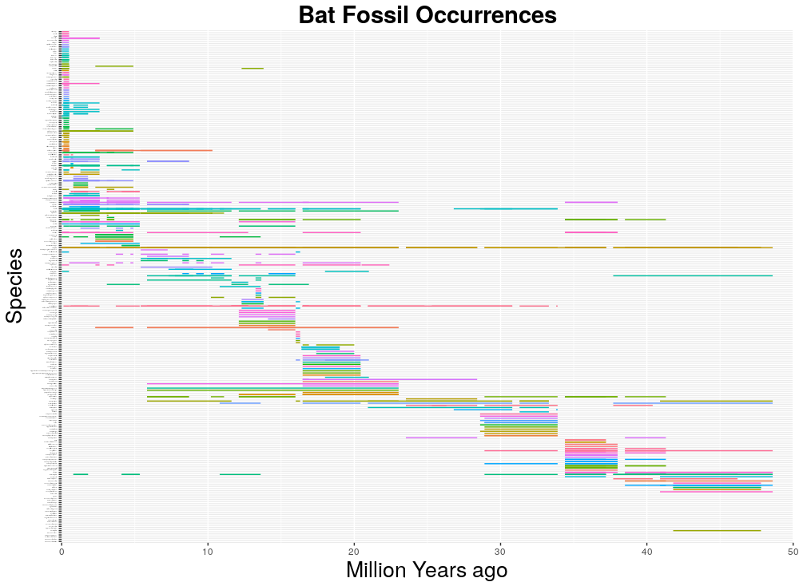
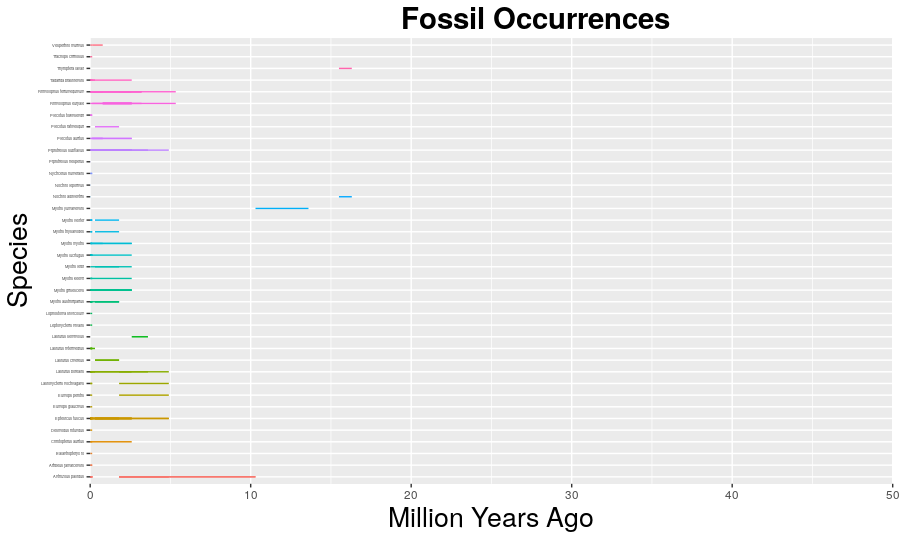
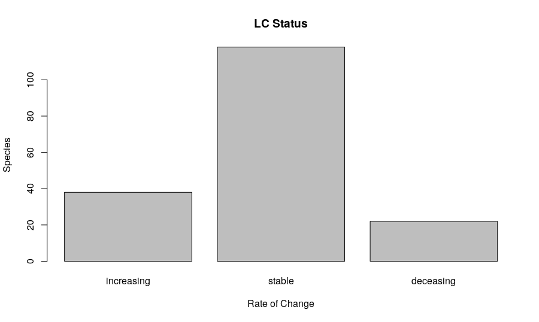
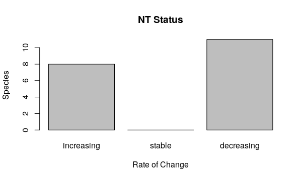
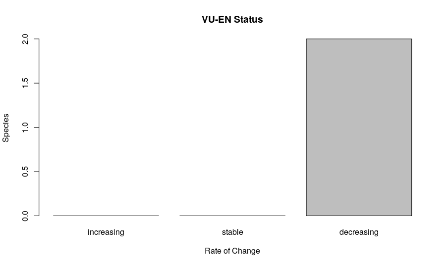
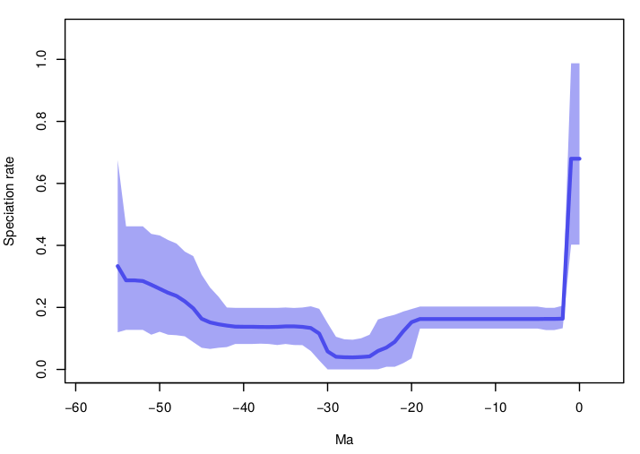
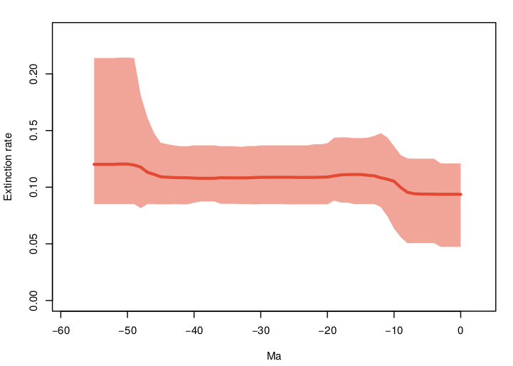
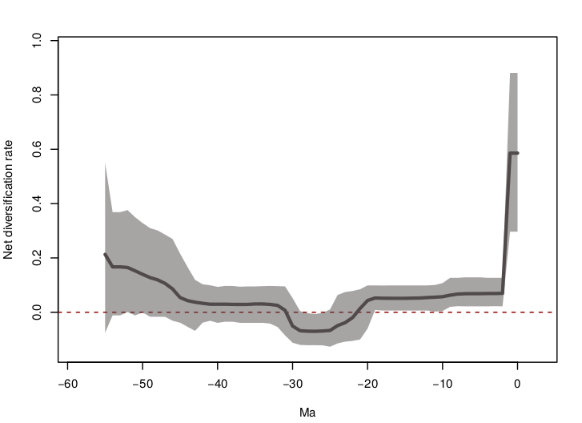
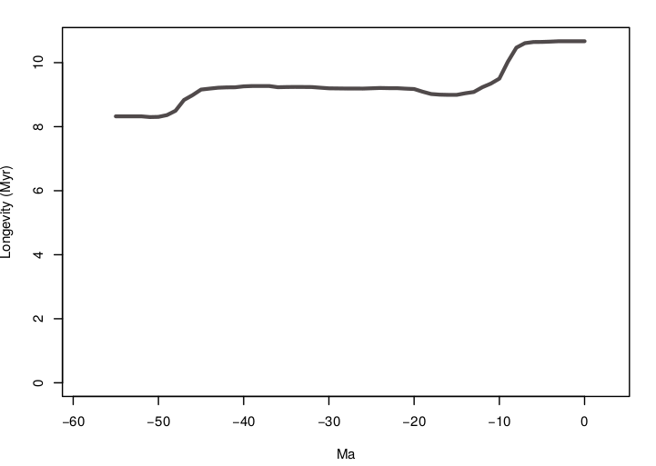

## Introduction
With over 1,300 species extant species today, Chiroptera (commonly known as bats), are one of the most successful mammals, only outcompeted by Rodentia(commonly known as rats) [Bat Conservation International]. Bats have high species richness and high species abundance with few bat species in danger of extinction [International Union of Conservation of Nature]. They have adapted to all climates and terrains, excelling in tropical zones and active in human-dense and arid environments, where they often act as successful pollinators and seed dispersers [Fleming 2009]. 

In this study, we will understand the current endangered state of various Chiroptera species, and see if there are any significant changes in speciation rates or decline in populations. 

## Methods
Initially, Chiroptera data was extracted from The Paleobiology Database (PBDB), which downloaded a comma-separated value (csv) fossil record with accompanying data on minimum age, maximum age, early interval of appearance, and late interval of appearance submitted by researchers. This PBDB data had varying levels of identification for fossils, with some only being defined at the suborder level and others at the species level. I parsed through this data through the Linux shell with the grep command to specify fossils defined to the species level and shortened the data from the 1220 occurrences to 417. I then separated the column of accepted name into genus and species, and created a new csv file and included minimum age and maximum age in order to graph Chiroptera fossil occurrences through time. 

```{python, eval = F}
infile = "/home/eeb177-student/Desktop/eeb-177/final-project/chiroptera/newchiropteraspecies.csv"
with open(infile,'r') as species_records:
        trial = species_records.readlines()[17:]
from collections import defaultdict
output = open("chiropteragenusspeciesints.csv", "w")

for line in trial:
        species = line.split('","')[5] 
        minage = line.split('","')[11]
        maxage =  line.split('","')[10]
        genus = species.split(" ")[0]

        outline = "{},{},{},{}\n".format(genus,species,minage,maxage)
        print(outline)
        output.write(outline)
output.close() 
```
Using the same PBDB techniques, I extracted a separate csv file of Chiroptera with accompanying location data in longitude latitude coordinates. I similarly parsed through the data to retrieve only lines with complete species identification data through the Linux shell, and plotted with Rstudio. I placed the longitude data into one variable, and did the same with the latitude data and placed the points on the ggplot world map. 

Threat levels were downloaded as a csv file from the International Union for Conservation of Nature (IUCN) Red List, which included data on about 1157 unique species. Since I wanted to compare the fossil PBDB records with the IUCN threat levels, I merged the two data files by matching identified species found in both files. In the PBDB file, the identified name of the fossil record is in one column, so I cut and separated them with python using a similar code I had before. 
```{python, eval = F}
infile = "/home/eeb177-student/Desktop/eeb-177/final-project/chiroptera/newchiropteraspecies.csv"
with open(infile,'r') as species_records:
        trial = species_records.readlines()[17:]
from collections import defaultdict
output = open("chiropteraspeciesonly.csv", "w")

for line in trial:
        name = line.split('","')[5]
        genus = name.split(" ")[0]
        species = name.split(" ")[1]

        outline = "{},{}\n".format(genus,species)
        output.write(outline)
        print(outline)
        
output.close() 
```
I then cut the Red List data to show just the two columns of genus and species identfication and compared the contents with for loops in python. 

```{python, eval = F}
import csv

file1 = open("/home/eeb177-student/Desktop/eeb-177/final-project/chiroptera/   redlistgenusspecies.csv", 'r')
reader1 = csv.reader(file1)
list1 = list(reader1)

file2 = open("/home/eeb177-student/Desktop/eeb-177/final-project/chiroptera/chiropteraspeciesonly.csv", 'r')
reader2 = csv.reader(file2)
list2 = list(reader2) 

FO = open("/home/eeb177-student/Desktop/eeb-177/final-project/chiroptera/same_data.csv", 'w')

list3 = []

for item in list2:
    if item in list1:
        list3.append(item)
        FO.write("%s\n" %(item))
print(list3) 

FO.close()
file1.close()
file2.close() 
```

This creates a new csv file with genus and species identification that was found in both PBDB and IUCN Red List datasets. With the shell grep command, I kept lines with the identified names in the PBDB file that were in the matching dataset. We then appended the Red List data of the identified species to this dataset. 

Using a combination of grep and word count line commands, I created smaller data sets separating Red List species by their threat level and counting the total number in each set. I repeated this with the overlappng PBDB Red List dataset.

## Results 

The Chiroptera Order has been very successful, with a majority of their species still suriving today. Figure 1 shows bat fossil occurences through time, created through Rstudio. It orders the PBDB fossil data from genus and species with respect to early interval of appearance and late interval of appearance. This shows different points of large speciation and extinction events based off the time interval indicated by the graphed line. We can see the life history of the species and approximate how many species of bats are still extant. Figure 2 provides a better view of the speciation occurence of bats through time, showing high peaks closer to the present. This suggests a recent increased speciation event, but these graphs still say nothing about the survivaility of resulting new species. 


```{r, echo = F, eval = F}
library(ggplot2)

setwd("/home/eeb177-student/Desktop/eeb-177/final-project/chiroptera")
chiroptera <- read.csv("/home/eeb177-student/Desktop/eeb-177/final-project/chiroptera/chiropteragenusspeciesints.csv", header = F, as.is = T)

species <- chiroptera[,4]
maxage <- chiroptera[,9]
minage <- chiroptera[,10]

chiroptera_occ <- ggplot(chiroptera_occ, aes( x = species, maxage, colour = species))

chiroptera_occ + geom_linerange(aes(ymin = minage, ymax = maxage)) + theme(legend.position="none") +  coord_flip() +  theme(axis.text.y = element_text(size=3)) + scale_y_continuous(limits=c(0, 50), expand = c(0, 0), breaks=c(0, 10, 20, 30, 40, 50)) + labs(title = "Chiroptera Fossil Occurrences", x = "Species", y = "Million Years Ago") + theme(plot.title = element_text(hjust = 0.5, size=22, face = "bold"), axis.title =element_text(size=20)) 

chiroptera_occ <- ggplot(chiroptera, aes( x = fct_reorder(species, minage, .desc = T), maxage, colour = genus))

chiroptera_occ + geom_linerange(aes(ymin = minage, ymax = maxage + 0.5)) + theme(legend.position="none") +  coord_flip() +  theme(axis.text.y = element_text(size=3)) + scale_y_continuous(limits=c(0, 50), expand = c(0, 0), breaks=c(0, 10, 20, 30, 40, 50)) + labs(title = "Chiroptera Fossil Occurrences", x = "Species", y = "Ma ago") + theme(plot.title = element_text(hjust = 0.5, size=22, face = "bold"), axis.title =element_text(size=20)) 

```


```{r, fig.width=5, fig.height=4, fig.align='center', fig.cap="Bat Speciation Through Time"}
library(ggplot2)
setwd("/home/eeb177-student/Desktop/eeb-177/final-project/chiroptera")
chiroptera <- read.csv("/home/eeb177-student/Desktop/eeb-177/final-project/chiroptera/chiropteragenusspeciesints.csv", header = F, as.is = T)
names(chiroptera) <- c("genus", "species", "minage", "maxage")
head(chiroptera)

library(forcats)
library(tidyr)
library(dplyr)

diversity <- chiroptera %>% gather(key = type, value = age, minage, maxage) %>% mutate(count = ifelse(type == "maxage", 1, -1)) %>% group_by(age) %>% summarise(count = sum(count))  %>% arrange(-age, -count) %>% mutate(diversity = cumsum(count)) 

ggplot(diversity, aes(x = age, y = diversity)) + geom_step()
```

In order to understand the survivability and threat rate of extant Chiroptera, I looked at the Red List data and sorted them based on threat level. I found that of all 1157 extant species, 412 fell under Least Concern (LC), 37 were Neart Threatened (NT), 57 were Vulnerable (VU), 30 were Endangered (EN), 17 were Critically Endangered (CR), 0 were Extinct in the Wid (EW), 0 were Extinct (EX), and 121 were Data Deficient (DD) all graphed in Figure 3. Chiroptera are not in severe threat of extinction, which show their success as a general order.

```{r, fig.width=5, fig.height=4, fig.align='center', fig.cap="Threat Levels of All Bats"}
redlistendangered <- read.csv(file ="/home/eeb177-student/Desktop/eeb-177/final-project/chiroptera/redlistendangeredcount.csv")
redliststatus <- c("LC","NT","VU","EN","CR","EW","EX","DD")
redlistnumber <-redlistendangered[,2]
barplot(redlistnumber,main="Red List Bat Endangered Status", xlab="Endangered Status", ylab= "Number of fossils", names.arg=redliststatus)
```

I then merged the PBDB data and Red List data to understand how overlapping bat species are faring. This way, we can see if there are any particularly successfuly species in terms of long life history. I repeated the steps above to retrieve an overview of the life history, depicted in Figure 4. 



```{r, echo= F, eval = F}
setwd("/home/eeb177-student/Desktop/eeb-177/final-project/chiroptera")
chiroptera <- read.csv("/home/eeb177-student/Desktop/eeb-177/final-project/chiroptera/matchinggenusspeciesints.csv", header = F, as.is = T)
names(chiroptera) <- c("genus", "species", "minage", "maxage")
head(chiroptera)

library(forcats)
library(tidyr)
library(dplyr)

chiroptera_occ <- ggplot(chiroptera, aes( x = fct_reorder(species, minage, .desc = T), maxage, colour = genus))

chiroptera_occ + geom_linerange(aes(ymin = minage, ymax = maxage + 0.5)) + theme(legend.position="none") +  coord_flip() +  theme(axis.text.y = element_text(size=3)) + scale_y_continuous(limits=c(0, 50), expand = c(0, 0), breaks=c(0, 10, 20, 30, 40, 50)) + labs(title = "Chiroptera Fossil Occurrences", x = "Species", y = "Million Years Ago") + theme(plot.title = element_text(hjust = 0.5, size=22, face = "bold"), axis.title =element_text(size=20))

```

The matching bat species in the PBDB database and Red List database are all extant species, which explains the exclusion of extinct ancestors. From this, we take a look at the number of species in each threat level, and found 190 fossils to correlate with LC threat levels, 19 with NT, 1 with VU, 0 for CR, EW, and EX, and 1 for DD (Figure 5).

```{r, fig.width=5, fig.height=4, fig.align='center', fig.cap="Threat Level for PBDB Fossils"}
matchedendangered <- read.csv(file ="/home/eeb177-student/Desktop/eeb-177/final-project/chiroptera/PBDBendangerednumber.csv")
status <- matchedendangered[,1]
number <-matchedendangered[,2]
barplot(number,main="PBDB Bats Endangered Status", xlab="Endangered Status", ylab= "Number of fossils", names.arg=status)

```

Most of the species remain at the LC level, but such a distinction does not necessarily say anything about the population other than its species abundance. I then graphed these threat levels to see how the population rate is increasing in Figures 6 - 8 below using the same format.






 These graphs show that the population of extant Chiroptera is majority stabe, with only two species of the matched PBDB and Red List data set having declining population. This only shows a small glimpse of potential population changes over time though, so I used Pyrate to extrapolate this data, as shown in the following graphs (Figures 9-12). Colored portions of the graphs correspond to the possible range, while the line shows expected outcome. 
 
 
 




\clearpage

## Discussion
Within the varying populations of Chiroptera, we see a majority of extant species maintaining a stable population growth rate as seen in the Figures 6-8. Additionally, we see a possibility for increase in speciation and decrease in extinction rates through the Pyrate figures 9-10, leading to a positive net diversification rate seen in Pyrate figure 11.  

This provides more evidence showing how successful Chiroptera are in terms of speciation and how they are better adapted at surviving possible extinction events. Since bats are found on all 7 continents and are found even in extreme climates, this makes them an important seed disperser and pollinator for those regions. The resiliance of these species allows them to complete their roles and possibly take on additional pollination and diserpsal tasks left from declining populations of birds and bees [Fleming 2009]. 

One point of consideration is that PBDB is a pure fossil record, meaning that its record of current data may not be accurate. However, our inclusion of the Red List data provides a better overall picture of the current state of bats while providing ancestral history. This makes our data more representative of the past and the present. 

Though our data shows strong evidence that bat populations are doing well, White-Nose Syndrome is decimating North American bat populations. This disease is primarily concentrated in the Northeast region of the United States and Canada, and is threatening extinction of *Myotis lucifugus*, amoung 6 other species [Frick 2010]. Since bats are important pollinators globally, it is important to continue to study the dispersal of this disease to maintain eoclogical integrity. Future studies could include understanding the ecological impact of White-Nose Syndrome by comparing the agricultural output of farms neighboring diseased bats to farms with unaffected bat populations. 

Github Link: https://github.com/eb177christinaz

## References

"Chiroptera." IUCN Red List.  Web.
"Chiroptera." Paleobiology Database.  Web.
"Everywhere." Everywhere. Bat Conservation International, Web. 24 Mar. 2017.
Fleming, T. H., C. Geiselman, and W. J. Kress. "The Evolution of Bat Pollination: A Phylogenetic Perspective." Annals of Botany 104.6 (2009): 1017-043.
Frick, W. F., J. F. Pollock, A. C. Hicks, K. E. Langwig, D. S. Reynolds, G. G. Turner, C. M. Butchkoski, and T. H. Kunz. "An Emerging Disease Causes Regional Population Collapse of a Common North American Bat Species." Science 329.5992 (2010): 679-82.

